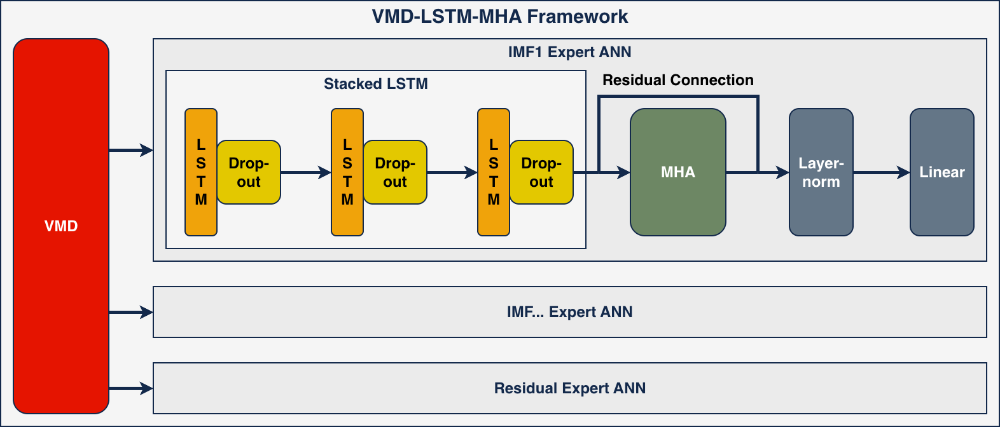
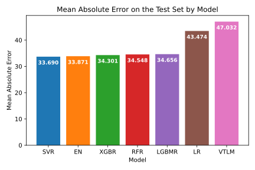

# Evaluating hybrid deep learning architectures for day-ahead electricity price forecasting in the german spot market

This repository is the official implementation of *Evaluating hybrid deep learning architectures for day-ahead electricity price forecasting in the german spot market*.



### Authors

Benjamin Leidig, Hyoeun Lee (mentor).

Yihan Lin and Jaehyung Kim also contributed to an earlier version of this repository. Their work can be found under the `yihan_model_dev` and `jay_model_dev` folders, respectively.


### Abstract

Forecasting day-ahead electricity prices is a longstanding focus of econometric research and energy market participants. Recent studies indicate that contemporary approaches, including hybrid and deep learning techniques, are increasingly used. However, the complexity and resource requirements of advanced techniques make custom hybrid learning architectures challenging. For example, inconsistent adherence to temporal constraints is a recurring limitation. Additionally, inappropriate model interpretations and comparisons can be misleading, often due to the black-box nature of neural networks. To address these limitations, a comprehensive selection of feature engineering and machine learning techniques was used to forecast hourly day-ahead electricity prices on the German spot market. This selection included architectures incorporating Variational Mode Decomposition, convolutional and recurrent neural networks, multi-head attention, and transformers, all under strict temporal training and forecasting constraints. The supervised models and signal decomposition techniques were tuned using Bayesian optimization and frequency separation analyses, respectively. To compare real-time performance, these frameworks were tested on a year of hourly data. The results revealed that novel hybrid deep learning architectures demonstrate superior performance during regime changes and volatility spikes inherent to energy markets compared with traditional statistical methods.


### Requirements

To install requirements:

```
pip install -r requirements.txt
```

It is recommended that a separate virtual environment is used for the purpose of running scripts from this repository. It is also recommended to use [uv](https://docs.astral.sh/uv/) for virtual environment management. To install requirements using `uv`:

```
uv pip install -r requirements.txt
```

For hyperparameter tuning, model training, and model predictions, scripts are intended to be run on an HPC computer cluster with GPU availability. Thus, an up-to-date remote directory must also be kept on an HPC computer cluster. Depending on the specific setup, some of the `bash` scripts may need slight modifications to file paths.


### Data Pipeline

The effective data pipeline is the following:

1) `collect_data.py`
- Queries *Bright Sky* and *Energy-Charts* APIs for the respective data.

2) `merge_data.py`
- Gathers, time-aligns observations, coverts to `pandas` *DataFrames*, and merges all JSON data from the previous step.

3) `align_data.py`
- Creates the lagged `price` columns in the dataset.

4) `build_features.py`
- Creates rolling `price` variance and mean columns in the dataset.

5) `dmf_features.py`
- Creates the Direct Multi-Step Forecasting columns and dataset structure.

5) `vmd_features.py`
- Creates the Hybrid forecasting columns and dataset structure.

6) `split_data.py`
- Creates train, validation, and test splits for all dataset types.

7) `preprocess_data.py`
- Z-score standardizes each split for each dataset.


### Training

Training scripts for each model independently are contained under `scripts/models/train/`. Note that, while possible to run on a local machine, these scripts are intended to be ran on a HPC computer cluster.


### Evaluation

Evaluation (prediction-generating) scripts for each model independently are contained under `scripts/models/predict/`. Note that, while possible to run on a local machine, these scripts are intended to be ran on a HPC computer cluster.


### Pre-Trained Models

Pre-trained models can be found under the respective folder under `models/`, within the `full/` subfolder. The proposed "best" model is contained under `models/hybrid/full/vlm/` (one *PyTorch* checkpoint file per IMF model).


### Results

In-depth statistical and visual analyses of results are contained under `notebooks/` (with output under `reports/figures/`). An example result is shown below:



Furthermore, presentations can be found in Keynote and PDF format under `reports/presentations/`.


### Contributing

To contribute to this research effort, please abide by the guidelines and permissions provided by the MIT License.